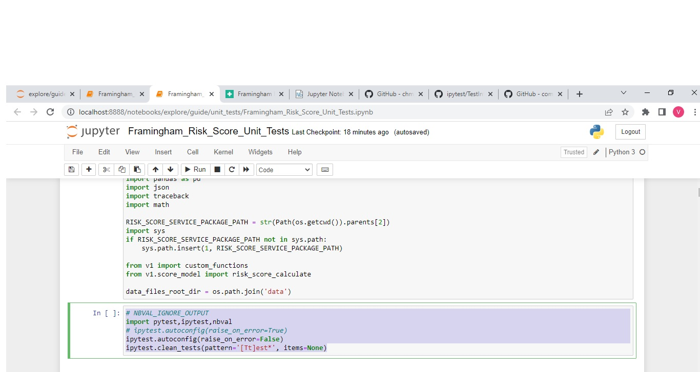
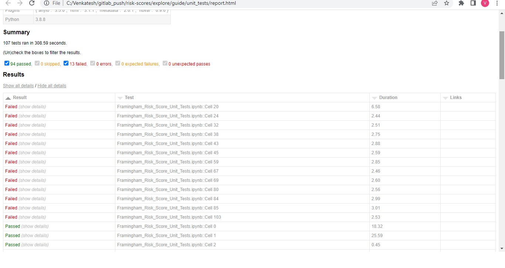

## Execute with Papermill Commandline
  `papermill input_notebook_file output_notebook_file`
  - Open the test output notebook generated in test_outputs directory and view the failures with detailed tracebacks.

## **Preferred** -- Execute with Papermill concept implemented runner file(runner.py)
  `python -m runner.py`
   - Open the test output notebook generated in test_outputs directory and view the failures with detailed tracebacks.
   
   **Configuration**
   

## PyTest with nbval execution(by using this we can export the result as html report)
   `py.test -vv -s --nbval {model_name}_Risk_Score_Unit_Tests.ipynb --html=test_outputs/{model_name}_report.html --self-contained-html`
   - One limitation with this approach is test name is not fetched by library and instead of that cell name is available. Issue is already in Open status for this feature in nbval Github page.
   - To use this execution setup, open the specific risk model score test notebook and navigate to cell No 3 and set this(flag raise_on_error=False ) **ipytest.autoconfig(raise_on_error=False)** flag instead of **ipytest.autoconfig(raise_on_error=true)**
     to get the failues.

   **Sample Report**
   

## Notes
1. Always define the risk score model name in **runner.py** for bulk execution of tests
2. This test suite uses nbval and ipytest python test library with pytest for running the tests in jupyter notebook cells.

## References
  - **ipytest Github Link** - [https://github.com/chmp/ipytest](https://github.com/chmp/ipytest)
  - **ipytest Assertion Rewrite used in Tests Info** - [https://github.com/chmp/ipytest/blob/main/tests/TestIntegration.ipynb](https://github.com/chmp/ipytest/blob/main/tests/TestIntegration.ipynb)
  - **nbval Github Link** - [https://github.com/computationalmodelling/nbval](https://github.com/computationalmodelling/nbval)
  - **nbval doc** - [https://nbviewer.org/github/computationalmodelling/nbval/blob/master/docs/source/index.ipynb](https://nbviewer.org/github/computationalmodelling/nbval/blob/master/docs/source/index.ipynb)
